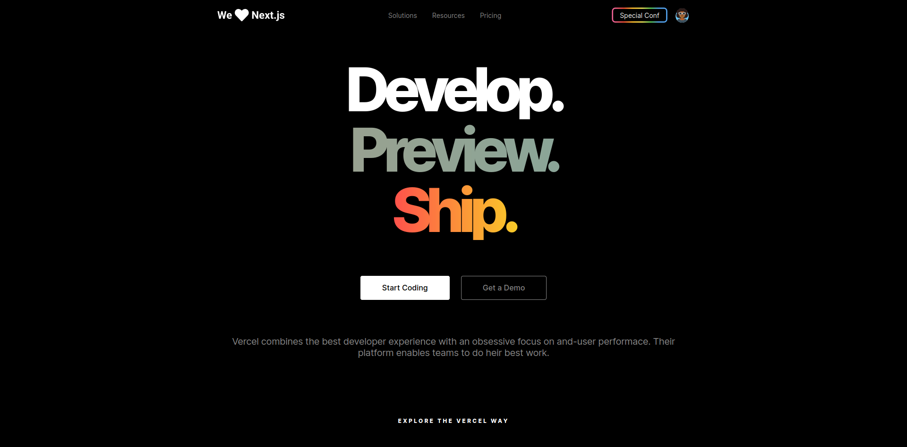

<h1 align="center">
UI Clone - Vercel (Homepage)
</h1>

<a href="https://vercel.com">Vercel</a> Homepage UI clone for study purposes.

Click <a href="https://www.youtube.com/playlist?list=PL85ITvJ7FLohTZv9cC5-PrZ39Q3cugWqp">here</a> to the YouTube playlist.

  

## 📸 Screenshot

## 🧪 Resources

- ✔ HTML, SCSS, JS
- ✔ SVG Images

## 💻 Start Dev Environment for VSCode

1. Open project folder in `VSCode`
2. Install `Live Server` and `Live Sass Compiler` extension
3. Right click `index.html` > `Open with Live Server`
4. Access the **generated address** in your browser 🚀

## 📝 License

This project is licensed under the MIT License. See the [LICENSE](./LICENSE.md) file for details.
